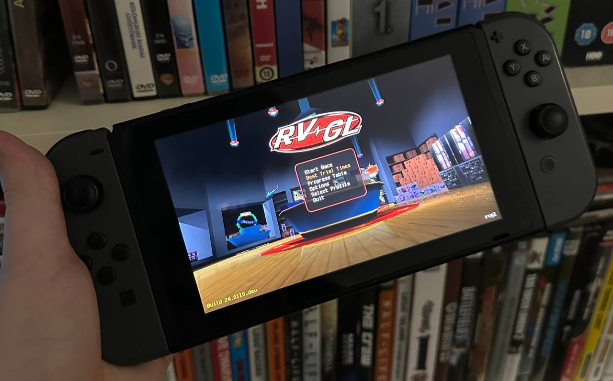

# Native RVGL port for Nintendo Switch

I am pleased to announce that RVGL has been ported to Switch! Huge thanks to [fgsfdsfgs](https://github.com/fgsfdsfgs) for the proper libunistring library and the help with the makefile!

**Features of the port:**
- Everything works fine as on the other versions
- Cross-Platform multiplayer
- Every custom content works
- Joycons are the default controller, but usb keyboard is also supported
- Split screen multiplayer with joycons (Just setup first the controls in the settings)
- Future RVGL updates will be released for the Switch too from now on

**How to install**
1. Download the latest [release](https://github.com/BirdSentinel/rvgl-for-switch/releases) from here
2. Make a folder on your Switch: `switch\rvgl`
3. Put the release zip contents in it
4. Obtain [game data](https://distribute.re-volt.io/releases/rvgl_full_win64_original.zip) and put everything in `switch\rvgl` **except** _rvgl.exe_ and the _dll files_.
5. Launch from **hbmenu**, enjoy!